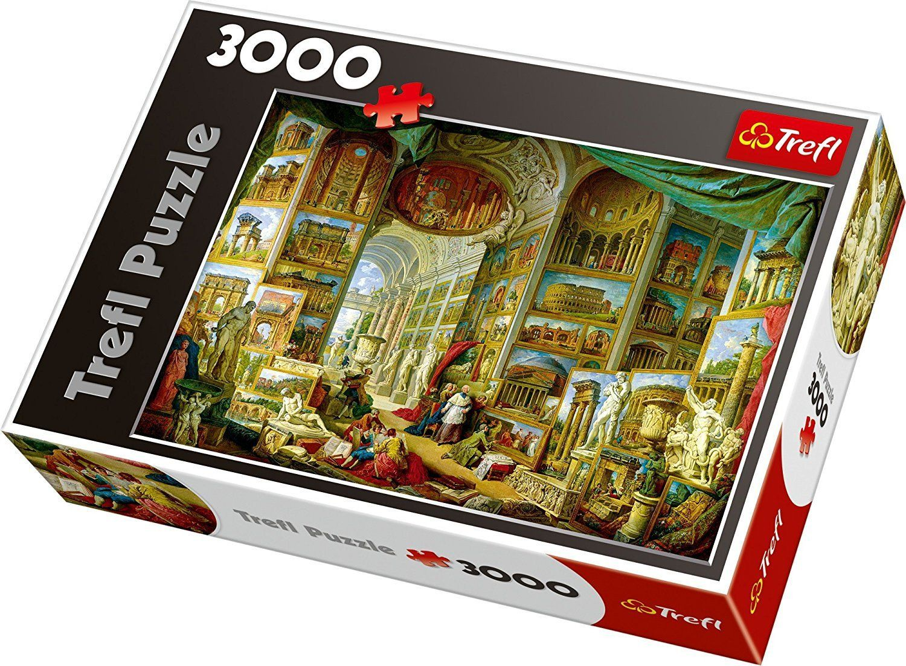

# Puzzle table display

### Notice
The program cannot be run yet because the Raku libraries, where this repository depends on, are not available. These libraries are still in development. For more info about that repo [please look here](https://github.com/MARTIMM/gnome-source-skim-tool).

## Purpose

Display a table of puzzles made by Palapeli, a linux puzzle game.

The Palapeli puzzle program is a great program to play with. However, the display of the puzzles I would like to change it a bit. There are issues posted at the repository but the developer has many other things to do and therefore there is slow progress in the development of Palapeli.

I am also working on a language binding between Raku and the Gnome libraries to create all sorts of graphical interfaces. To test the modules out I thought that this project would be a nice start to see if the Raku modules work properly.

### What to implement

Nothing that what works fine with Palapeli;

* Create new puzzles and export them.
* Playing a puzzle.
* Starting a puzzle from commandline.

And a small list of things to change in the puzzle table program;

* The puzzle table of Palapeli has a large field of all puzzles in it. You can order it by name or by the number of pieces.
* The picture of the puzzle is small.
* There is no information about the progress of a puzzle. The only way to get this info is by starting the puzzle.

What the new program should do

* Gather the previously created puzzles from the installation collections and copy them elsewhere.
* Be able to rename puzzles.
* Be able to make categories from names or otherwise. Selecting a category shows the puzzles in that category thus displaying a smaller table.
* Show a larger picture of the puzzle. Also make a more puzzle like display e.g.
  
* Show on the same picture how much is finished.
* Add newly created and exported puzzles.

<!--
## Description

When the program is started for the first time, there will be nothing to show. From the menu you will be able to select a Palapeli collection. To give an idea where to find the collections of several types of installations;
* the snap installation at: `$*HOME/snap/palapeli/current/.local/share/palapeli/collection`;
* the flatpack installation at: `$*HOME/.var/app/org.kde.palapeli/data/palapeli/collection`
* the standard installation at: `$*HOME/.local/share/palapeli/collection/`

These are paths at my Fedora OS but you may get a hint where to find them on your computer.

You can point to directories where you have stored exported puzzles.
-->