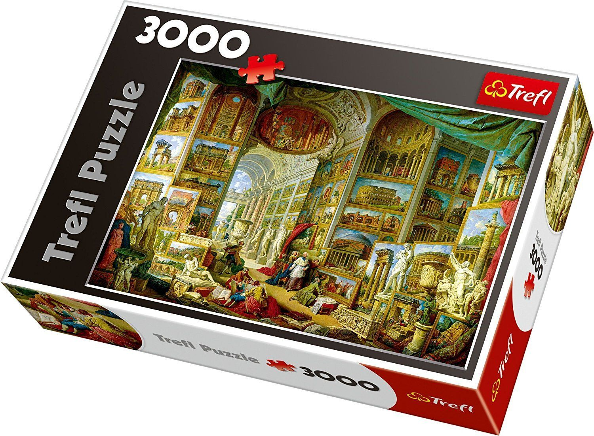

# Puzzle table display

## Purpose

Display a table of puzzles made by Palapeli, a linux puzzle game.

The Palapeli puzzle program is a great program to play with. However, the display of the puzzles I would like to change it a bit. There are issues posted at the repository but the developer has many other things to do and therefore there is slow progress in the development of Palapeli.

I am also working on a language binding between Raku and the Gnome libraries to create all sorts of graphical interfaces. To test the modules out I thought that this project would be a nice start to see if the Raku modules work properly.

### What to implement

Nothing which works fine with Palapeli;

* Create new puzzles and export them.
* Playing a puzzle.
* Starting a puzzle from commandline.

And a small list of things to change in the puzzle table program;

* The puzzle table of Palapeli has a large field of all puzzles in it. You can order it by name or by the number of pieces.
* The picture of the puzzle is small.
* There is no information about the progress of a puzzle. The only way to get this info is by starting the puzzle.

What the new program should do is shown here in a TODO list.

### TODO
* menu and toolbox for some menu entries
  * file
    * [ ] quit, add dialog in between
    * [ ] refresh sidebar
  * container
    * [x] add container
    * [x] rename container
    * [x] delete container, only when empty
  * category
    * [x] add category
    * [x] rename category, also 'rename' (=move) to different container
    * [x] delete category, only when empty
    * [x] (un)lock a category
  * puzzle
    * [x] move selected puzzles
    * [x] archive selected puzzles
  * help
    * [x] about
    * [x] shortcut keys overview
    * [ ] user defined shortcuts

* command line
  * [x] add `--restore=<name>` option to restore an archive.
  * [ ] add `--palapeli=<type>` option to select preferred program.
  * [x] By default the location where everything is to be found is `~/.config/io.github.martimm.puzzle-table`. The following files and directories are;
      * `global-config.yaml`: Global configuration. Can be changed with `--root-global`.
      * `puzzle-data.css`: The css file.
      * `images/`: The images for buttons.
      * `puzzle-table-data/`: Directory for puzzles. This can be changed with `--root-tables` option.
      * `puzzle-trash/`: Directory for removed puzzles.
  * [ ] add `--root-global=<path>` 
  * [ ] add `--root-tables=<path>[,<path>, …]` option to specify a preferred puzzle table location.
  * [ ] generating palapeli puzzles from commandline -> C++ hook into Palapeli.

* shortcut keys
  * [x] `<CTRL>Q` to quit program

* program methods
  * [x] rename and move archiving operations into one module
  * [ ] drag and drop.
  * [x] remember state of an opened (expanded) container
  * [x] need to add key `<categories>` in containers to add other keys
  * [ ] add state info to containers to sum up states of contained categories
  * [x] importing puzzles should be shown in table and counts updated
  * update dialogs
    * [ ] work with focus and return chars in entries.
    * [x] show more space in a dialog. css font size.
    * [x] filled in values if possible on entries and drop down lists.
    * [x] extra dialogs to delete empty containers and categories
  * [x] puzzle table display update
  * [ ] fix needed; sometimes quit does not end program

* storage
  * [ ] When growing too large, configurations should be divided over several locations. Current default location is at `/home/marcel/.config/io.github.martimm.puzzle-table/` and has following files and directories
    * `images`. Not duplicated.
    * `puzzle-data.css`. Not duplicated.
    * `puzzle-table-data`. Here is the puzzle data stored, so it must be duplicated.
    * `puzzle-trash`. Here is the puzzle trash stored, so it must also be duplicated.
    The module **PuzzleTable::Config::Categories** gets the root already from an argument to BUILD() so we can maintain several instances of different roots. Also, the config file `categories.yaml` must be split because only the _containers_ key is different for the several roots.
    * [x] Split fixed portion in `categories.yaml` into `<root>/global-config.yaml`.
    * [x] Because of this, the top level key in `categories.yaml` can be removed because we have moved the other toplevel keys to the `global-config.yaml`.
    * [ ] The instance of **PuzzleTable::Config::Categories** is saved in **PuzzleTable::Config**. Because of using handles on the class we cannot have an array to store several **::Categories** classes. So the solution to this is to maintain it in the **::Categories** class.
    * The program is fixed to a location in `~/.config`. This must now be controlled by new options. When options are absent the program defaults to the default location. The statement `has Hash $.categories-config;` found the module, can be extended holding a root path in its top level key while the the second level becomes the container name keys. The paths are unique. where the 
      * [ ] --root-global=\<path>. Option to set the location for all global data like the `<root>/config.yaml` and images. By default in the `~/.config` directory. This can be set only once when the first instance of the program starts.
      * [ ] --root-table=\<path>,\<path>,…. This points to the directory where the table data and trash archive is stored. This can be set multiple times and defaults to the path set by the --root-global option.

* [x] Gather the previously created puzzles from the several Palapeli collection directories and copy them elsewhere.
* [x] Use the Palapeli program of different install types; os standard, Snap or Flatpak.
* [x] Be able to make categories. Selecting a category shows the puzzles in that category thus displaying a smaller table.
* [x] Be able to rename categories.
* [ ] Show a larger picture of the puzzle. Also make a more puzzle like display e.g.  At the moment its just a larger image.
* [x] Show on the same picture how much is finished.
* [x] Add newly created and exported puzzles.
* [x] Remove a puzzle and store it in an archive.
* [x] Restore a puzzle from the archive.
* [x] Move puzzles to other categories.
* [x] Categories are shown in a sidebar
* [x] Grouping categories in an expandable widget to narrow a long list.
* Drag and drop
  * [ ] Drag selected puzzles to different category
  * [ ] Drag selected puzzles to different container and create new category
  * [ ] Drag selected puzzles to different root and create new container and category

## Description
<!--

When the program is started for the first time, there will be nothing to show. From the menu you will be able to select a Palapeli collection. To give an idea where to find the collections of several types of installations;
* the snap installation at: `$*HOME/snap/palapeli/current/.local/share/palapeli/collection`;
* the flatpack installation at: `$*HOME/.var/app/org.kde.palapeli/data/palapeli/collection`
* the standard installation at: `$*HOME/.local/share/palapeli/collection/`

These are paths at my Fedora OS but you may get a hint where to find them on your computer.

You can point to directories where you have stored exported puzzles.
-->

## Dependencies

Working on the Linux OS the use of the programs and libraries are oriented to that OS. Most libraries and programs might be available on Windows or Apple systems but I do not have any experience on the locations of the software or any way to install them.

### Programs and libraries

* Palapeli
* ImageMagick
* Gtk4 (having also Gdk4, Gsk4, Graphene,, Gio, GObject, Glib, Cairo, Pango libraries
* Icon themes from Gnome, Breeze and Adwaita

### Raku modules

* Gnome::Gtk4:api<2>
* Archive::Libarchive
* Getopt::Long
* Digest::SHA256::Native

<!--
* Gnome::Cairo:api<2>
* Gnome::Gsk4:api<2>
* Gnome::Atk:api<2>
-->

# Attribution
## Icons
* Ions from
  * ['FlatIcon - bayu015'](https://www.flaticon.com/free-icons/category)
  * ['FlatIcon - twentyfour'](https://www.flaticon.com/free-icons/grid)
  * ['FlatIcon - Anggara'](https://www.flaticon.com/free-icons/categories)
  * ['FlatIcon - mynamepong'](https://www.flaticon.com/free-icons/puzzle)
  * ['FlatIcon - paonkz'](https://www.flaticon.com/free-icons/files-and-folders)
  * ['Freepik - Icon by judanna](https://www.freepik.com/icon/add_10110024#fromView=keyword&page=1&position=14&uuid=d07d88e3-b3e7-48da-9f3b-f1fc0703d53c)
  * ['icons8 - drag icons'](https://icons8.com/icons/set/drag--white)

<!--
* Icon from set ['Run icons created by Smashicons'](https://www.flaticon.com/free-icons/run).

* Icon from [Icons8](https://icons8.com/icon/ddoMPxn5moeM/girl-running).
-->