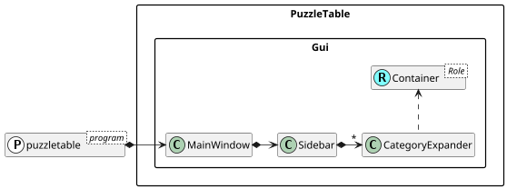

# Structure of program and modules

```plantuml
@startuml
scale 0.8

skinparam packageStyle rectangle
skinparam stereotypeCBackgroundColor #80ffff
set namespaceSeparator ::
hide members

'class PuzzleTable::Gui::Sidebar

Interface PuzzleTable::Gui::Container < Role >
class PuzzleTable::Gui::Container <<(R,#80ffff)>>

class puzzletable < program >
class puzzletable <<(P,#ffffff)>>

puzzletable *-> PuzzleTable::Gui::MainWindow
PuzzleTable::Gui::MainWindow *-> PuzzleTable::Gui::Sidebar
PuzzleTable::Gui::Sidebar *-> "*" PuzzleTable::Gui::CategoryExpander
PuzzleTable::Gui::Container <.. PuzzleTable::Gui::CategoryExpander

@enduml
```